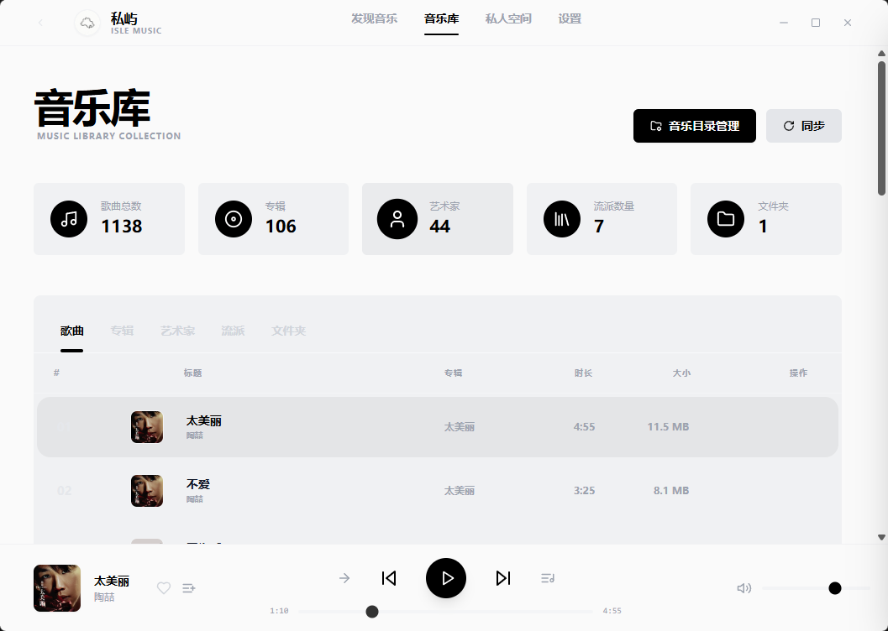
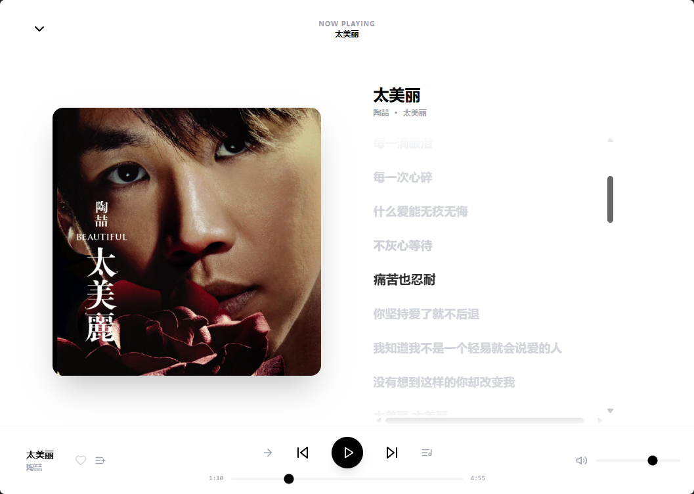
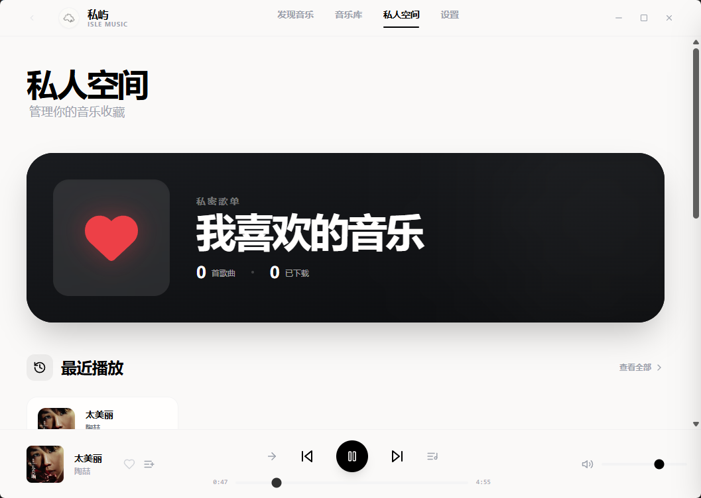

<div align="right">
  <a href="./README.md">🇨🇳 简体中文</a> | <strong>🇺🇸 English</strong>
</div>

<div align="center">
  <h1>🏝️ Isle</h1>
  <p><strong>Your private music library belongs only to you.</strong></p>
</div>

<br/>

**Isle** is a modern, cross-platform local music player built with **absolute data privacy** as its core. It provides a lightweight, ad-free experience with a stunning UI and user-owned cloud synchronization.

## 🌟 Core Philosophy & Promises

We reject the privacy theft and commercial interruptions of the streaming era. We promise you:

*   **🔒 Absolute Data Ownership**: Zero telemetry, zero data reporting. No server ever touches or stores your data.
*   **🫧 Absolute Purity**: Lifetime ad-free. No launch ads, pop-ups, marketing pushes, or algorithmic recommendations.
*   **🔌 True Offline Capability**: Core playback and music library management are 100% functional offline, with no forced network authorization required.

## ✨ Key Features

### 🎧 High-Performance Playback
*   **Universal Native Support**: Seamless hardware-level decoding for FLAC, APE, WAV, MP3, M4A, OGG, and other mainstream lossless/lossy formats.
*   **Lightning Fast Start**: Powered by Rust, the desktop app launches in under 2 seconds and achieves millisecond-level response times even when scanning a TB-scale ultra-large library.

### 🔄 Private Cloud Sync
*   **Any Cloud (WebDAV)**: Sync your playlists, playback progress, and collections as lightweight metadata to your own NAS or private cloud.
*   **End-to-End Encryption (E2EE)**: Enabled by the AES-GCM algorithm, sync data is encrypted locally and protected by your own keys at all times.

### 🎨 Modern UI & Aesthetics
*   **Premium Design Language**: Built with Tailwind CSS v3 and DaisyUI v4, featuring a stunning immersive Dark Mode and massive album art walls.
*   **Cross-Platform Native Experience**: A single codebase flawlessly adapts to Windows, macOS, Linux, Android, and Web.

### 🧘 Private Space
*   **Play History**: Automatically and non-blockingly logs every track you play, presenting a timeline of your listening journey.
*   **Systematic Likes**: Categorize your collections across artists, albums, and tracks to build your ultimate digital music asset archive.
## 📸 Preview

| Music Library | Immersive Play | Private Space |
| :---: | :---: | :---: |
|  |  |  |

## 🛠️ Technical Architecture

Isle utilizes a **Cargo Workspace** multi-package architecture, strictly separating core business logic from UI presentation layers.

| Module Layer | Tech Stack | Description |
| :--- | :--- | :--- |
| **UI Framework** | [Dioxus 0.7](https://dioxuslabs.com/) | Cross-platform core with reactive state and component trees. |
| **Database** | SQLite + SQLx | High-performance local retrieval, heavy indexing, and history persistence. |
| **Audio Engine** | Symphonia + Rodio | Universal audio decoding and cross-platform output. |
| **Styling** | Tailwind CSS v3 + DaisyUI v4 | Utility-first CSS and components for a consistent, beautiful UI. |
| **Encryption** | AES-GCM (RustCrypto) | Guaranteed security during cross-device sync (e.g., WebDAV). |

## 🚀 Quick Start

**1. Prerequisites**
* Install the latest [Rust Stable](https://www.rust-lang.org/tools/install) (1.75+).
* Install the Dioxus CLI: `cargo install dioxus-cli`.
* Install Node.js (Only required for initial Tailwind CSS building).

**2. Build & Develop**
```bash
git clone https://github.com/your-username/isle.git
cd isle

# Build UI styles
npm install
npm run build:css

# Serve Desktop App
cd packages/desktop
dx serve --platform desktop

# 3. Bundle & Release
# Example for Windows msi
dx bundle --platform desktop --release --package-types msi
```
> **Tip:** Keeping `npm run watch:css` running in a separate terminal will automatically recompile your Tailwind classes for UI debugging.

## 📅 Roadmap

- [x] **Phase 1 (MVP Foundation)**: Dioxus 0.7 base, high-performance local track scanning, and lossless playback.
- [x] **Phase 2 (Interaction)**: "Private Space" loop completion (debounced history logging, full-scale collection system).
- [ ] **Phase 3 (Sync & Security)**: WebDAV-based end-to-end encrypted metadata sync across platforms.
- [ ] **Phase 4 (Creation)**: Visual local LRC lyric editor and full custom tagging / categorization.

## ⚖️ License 

As an aggregator exploring the boundaries of geek privacy, Isle welcomes all forms of community contributions. All core framework code is permanently open-sourced under the [MIT License](LICENSE).

---
<div align="center">
  <b>Finding your own island in the sea of algorithms.</b>
</div>
